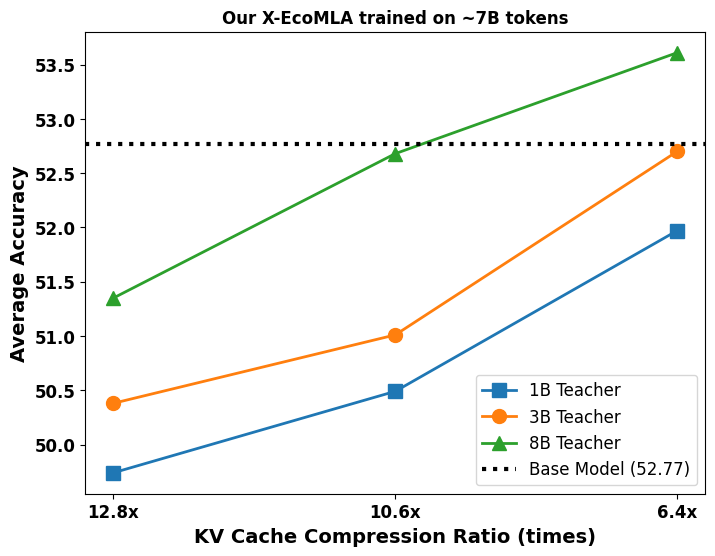

# X-EcoMLA: Efficient and Extreme KV Compression via Upcycled Attention

[](https://opensource.org/licenses/Apache-2.0) [](https://arxiv.org/abs/2503.11132)

**Official repository for X-EcoMLA: Upcycling Pre-Trained Attention into Multi-Layer Attention (MLA) for Efficient and Extreme Key-Value (KV) Cache Compression in Large Language Models.**

Large Language Models (LLMs) often face significant memory bottlenecks due to the large Key-Value (KV) cache required during inference. X-EcoMLA addresses this challenge by proposing a novel method to "upcycle" the existing attention mechanisms of pre-trained models into Multi-Layer Attention (MLA) structures. This approach achieves substantial KV cache compression with minimal impact on model performance, enabling more efficient deployment and inference.

This repository provides the code necessary to reproduce the results, train new X-EcoMLA models, and evaluate their performance.

## Features

* **Extreme KV Cache Compression:** Leverages MLA to significantly reduce the memory footprint of the KV cache.
* **Efficient Upcycling:** Modifies pre-trained attention layers rather than training from scratch.
* **Two-Stage Training Pipeline:** Employs end-to-end distillation followed by Direct Preference Optimization (DPO) for optimal performance and alignment.
* **Hardware Support:** Verified training procedures for both AMD Instinct™ MI300 and MI325 GPUs and NVIDIA H100/H200 GPUs.
* **Example Implementations:** Provides configurations and scripts for Llama3.2 models (1B and 3B parameters) and SmolLM models (135M, 360M, and 1.7B parameters).

## Table of Contents

* [Installation](#installation)
* [Training (Instruct Model)](#training-for-instruct-models)
    * [Stage 1: End-to-End Distillation](#stage-1-end-to-end-distillation)
    * [Stage 2: Instruction Tuning with DPO](#stage-2-instruction-tuning-with-dpo)
* [Training (Pre-trained Model)](#continual-pre-training)
* [Configuration](#configuration)
* [Evaluation](#evaluation)
* [Acknowledgements](#acknowledgements)
* [Citation](#citation)
* [License](#license)
<!-- * [Contributing](#contributing) -->


## Installation
We strongly recommend using Docker to ensure a consistent and reproducible environment.

**1. Clone the Repository:**
```bash
git clone https://github.com/AMD-AIG-AIMA/AMD-Hybrid-Models.git # <-- UPDATE THIS URL
cd AMD-Hybrid-Models/X-EcoMLA # <-- UPDATE THIS DIR NAME
```

**2. Build the docker:**

Choose the instructions based on your GPU hardware:

  * **For AMD Instinct™ MI300 and MI325 GPUs:**

      * We verified training using the `rocm/pytorch-training:v25.4` image.

    <!-- end list -->

    ```bash
    # Launch the Docker container with ROCm device access
    docker run -it \
      --device /dev/dri --device /dev/kfd \
      --device=/dev/infiniband --network host --ipc host \
      --group-add video --cap-add SYS_PTRACE \
      --security-opt seccomp=unconfined --privileged \
      -v $HOME:$HOME --shm-size 64G --name mla_training \
      rocm/pytorch-training:v25.4
    # Note: Adjust --shm-size and permissions based on your system configuration.

    # Inside the container, navigate to the cloned repo and install dependencies
    # Use FLASH_ATTN=1 for potential optimizations on AMD hardware
    cd /path/to/your/cloned/repo # e.g., cd /home/user/X-EcoMLA
    bash install.sh FLASH_ATTN=1
    ```


  * **For NVIDIA H100/H200 GPUs:**

      * We verified training using the `nvcr.io/nvidia/pytorch:25.01-py3` image.

    ```bash
    # Launch the Docker container
    docker run --gpus all -it -v $HOME:$HOME --shm-size 64G --rm nvcr.io/nvidia/pytorch:25.01-py3
    # Note: Adjust --shm-size based on your system capabilities.

    # Inside the container, navigate to the cloned repo and install dependencies
    cd /path/to/your/cloned/repo # e.g., cd /home/user/X-EcoMLA
    bash install.sh
    ```


**Note:** The `install.sh` script handles the installation of required Python packages and dependencies within the containerized environment.

## Training for Instruct models

X-EcoMLA utilizes a two-stage training strategy to distill instruct models for optimal results:

### Stage 1: End-to-End Distillation

  * **Goal:** Transfer knowledge from a larger, pre-trained teacher model to the smaller student model (with the MLA architecture).
  * **Method:** Minimize the Kullback–Leibler (KL) divergence loss between the output distributions of the student and teacher models. We generally observe better results when using a larger teacher model.
  * **Framework:** Uses `accelerate` and `fsdp` (configured via `configs/fsdp.yaml`) for distributed training.

**Example Commands:**

  * **Llama3.2-1B Student Model:**
    ```bash
    ACCELERATE_LOG_LEVEL=info accelerate launch --config_file configs/fsdp.yaml train_mla/train_distill.py configs/llama3.2_1B/mla_kv_rank_64_8bt.yaml
    ```
  * **Llama3.2-3B Student Model:**
    ```bash
    ACCELERATE_LOG_LEVEL=info accelerate launch --config_file configs/fsdp.yaml train_mla/train_distill.py configs/llama3.2_3B/mla_kv_rank_96_8bt.yaml
    ```
  * **SmolLM-135M Student Model:**
    ```bash
    ACCELERATE_LOG_LEVEL=info accelerate launch --config_file configs/fsdp.yaml train_mla/train_distill.py configs/SmolLM_135M/mla_kv_rank_16_1.7bt.yaml
    ```
  * **SmolLM-1.7B Student Model:**
    ```bash
    ACCELERATE_LOG_LEVEL=info accelerate launch --config_file configs/fsdp.yaml train_mla/train_distill.py configs/SmolLM_1.7B/mla_kv_rank_480_1.7bt.yaml
    ```
  **Note:** After training, need to get the `model.safetensors` using `accelerate merge-weights` for the following DPO stage and evaluation.

### Stage 2: Instruction Tuning with DPO

  * **Goal:** Further align the distilled model with desired behaviors and instruction-following capabilities.
  * **Method:** Apply Direct Preference Optimization (DPO) using a preference dataset.
  * **Framework:** Also uses `accelerate` and `fsdp`.

**Example Commands:**
   ```bash
   ACCELERATE_LOG_LEVEL=info accelerate launch --config_file configs/fsdp.yaml train_mla/train_dpo.py configs/dpo.yaml # <-- Update the paths in the config file
   ```
  **Note:** After training, need to get the `model.safetensors` using `accelerate merge-weights` for the evaluation.
  ```bash
   accelerate merge-weights global_step/pytorch_model_fsdp_0/ ./ # <-- Update the path to the latest checkpoint (e.g., global_step1000)
   ```

## Continual Pre-Training

X-EcoMLA can also be used to distill base models with pre-training. Here we provide examples to perform continual pre-training for `SmolLM-1.7B` model.

**Example Commands:**

  * **SmolLM-1.7B, self-distillation, KL divergence**
    ```bash
    ACCELERATE_LOG_LEVEL=info accelerate launch --config_file configs/fsdp.yaml train_mla/train.py configs/SmolLM_1.7B/mla_kv_rank_480_pretrain.yaml
    ```
    
## Configuration

  * Training hyperparameters, model paths, dataset details, MLA configurations (e.g., KV rank, quantization bits), and FSDP settings are controlled by `.yaml` configuration files (e.g., `configs/llama3.2_1B/mla_kv_rank_64_8bt.yaml`, `configs/fsdp.yaml`).
  * Please inspect these files and modify them according to your specific needs (e.g., dataset paths, teacher/student model identifiers, compute resources).

## Evaluation

We provide several checkpoints of X-EcoMLA for both pre-trained base models and instruct models [here](https://huggingface.co/collections/amd/amd-hybrid-models-67be591b09a4524abf65bcee). The test these checkpoints or your trained X-EcoMLA model, please run:
   ```bash
   python benchmark/llm_eval/lm_harness_eval.py \
    --model mla_hybrid \
    --model_args pretrained="amd/X-EcoMLA-1B1B-fixed-kv512-DPO" \  # Path to the checkpoint
    --tasks mmlu,hellaswag,piqa,arc_easy,arc_challenge,winogrande,openbookqa,pubmedqa,race \  # List of tasks
    --num_fewshot 0 --device cuda --batch_size 16
   ```

We also provide a script for batched evaluation:

1.  **Update Checkpoint Path:** Modify the `eval.sh` script to point to the directory containing your final model checkpoint (saved after the DPO stage).
    ```bash
    # Example modification within eval.sh
    ckpts=(
      "PATH_TO_YOUR_CKPT1"
      "PATH_TO_YOUR_CKPT2"
    )
    # ... rest of the script
    ```
2.  **Run Evaluation Script:** Execute the script from the root of the repository.
    ```bash
    bash eval.sh
    ```
    This script will typically run the model on standard benchmark datasets and report relevant metrics (e.g., perplexity, task-specific accuracy, memory usage). Check the script for details on the specific evaluation tasks performed.

## Results

### Self-distillation Evaluation
The table below reports zero-shot performance when X-EcoMLA learns from its own target model as the teacher (_self-distillation_).
We evaluate two SVD-based initialization strategies—fixed rank and dynamic rank—across nine LM-Harness tasks: ARC-Challenge (ARC), ARC-Easy (ARE), HellaSwag (HS), MMLU, OpenBookQA (OBQA), PIQA, PubMedQA (PBMD), RACE (RA), and WinoGrande (WG). 

| Model & Setting            | Init. Method                            | KV-Size | ARC  | ARE  | HS   | MMLU | OBQA | PIQA | PBMD | RA   | WG   | Avg. |
|----------------------------|-----------------------------------------|--------:|-----:|-----:|-----:|-----:|-----:|-----:|-----:|-----:|-----:|-----:|
| **Llama3.2-1B-Inst**       | Target Model                            | 100 %   | 37.97| 63.51| 60.77| 46.09| 35.00| 74.37| 60.20| 38.09| 59.67| **52.85** |
| X-EcoMLA ([ckpt](https://huggingface.co/amd/X-EcoMLA-1B1B-fixed-kv512-DPO))               | Fixed (r<sub>kv</sub>=512)              | 53 %  | 39.93| 63.89| 60.73| 42.39| 37.80| 74.92| 58.80| 40.77| 60.54| 53.31 |
| X-EcoMLA ([ckpt](https://huggingface.co/amd/X-EcoMLA-1B1B-dynamic-0.95-DPO))               | Dynamic (δ<sub>kv</sub>=0.95)           | 55 %  | 41.21| 64.86| 60.96| 42.86| 37.60| 74.43| 58.60| 39.23| 58.33| 53.12 |
| **Llama3.2-3B-Inst**       | Target Model                            | 100 %   | 45.90| 67.76| 70.36| 60.46| 36.20| 75.57| 69.60| 40.77| 67.17| **59.31** |
| X-EcoMLA ([ckpt](https://huggingface.co/amd/X-EcoMLA-3B3B-fixed-kv816-DPO))              | Fixed (r<sub>kv</sub>=816)              | 43 %    | 48.21| 70.45| 72.24| 57.42| 38.40| 76.55| 66.80| 46.22| 68.59| 60.54 |
| X-EcoMLA ([ckpt](https://huggingface.co/amd/X-EcoMLA-3B3B-dynamic-0.95-DPO))              | Dynamic (δ<sub>kv</sub>=0.95)           | 43 %    | 48.46| 69.99| 72.26| 57.73| 39.40| 75.79| 68.40| 46.32| 65.90| 60.47 |

### Extreme KV Cache Compression with Larger Teacher 
Here we study the impact of KV-cache compression and teacher model size on performance. Reducing the KV-cache size lowers accuracy, but larger teacher models help recover performance. We trained Llama3.2-1B-Inst on three different ranks using three different teachers.

**First)** **KV Size 15.6 %** (r<sub>kv</sub>=128, r<sub>q</sub>=1344, d<sub>qk</sub>=32) 
| Model & Setting | Teacher | Param | Tokens | ARC | ARE | HS | MMLU | OBQA | PIQA | PBMD | RA | WG | Avg. |
|-----------------|---------|-------|--------|----:|----:|---:|-----:|-----:|-----:|-----:|---:|---:|----:|
| **Llama3.2-1B-Inst** | – | 1.24 B | –  | 37.97| 63.51| 60.77| 46.09| 35.00| 74.37| 60.20| 38.09| 59.67| **52.85** |
|  X-EcoMLA  | Llama3.2-1B-Inst | 1.23 B | 7 B | 40.10 | 62.88 | 58.17 | 39.70 | 37.80 | 73.50 | 56.60 | 39.33 | 59.67 | 51.97 |
|  X-EcoMLA  | Llama3.2-3B-Inst | 1.23 B | 7 B | 39.33 | 64.86 | 58.92 | 41.86 | 37.40 | 73.83 | 58.80 | 39.71 | 59.59 | 52.70 |
|  X-EcoMLA  | Llama3.1-8B-Inst | 1.23 B | 7 B | 42.49 | 67.13 | 60.58 | 42.51 | 36.60 | 73.99 | 59.40 | 40.38 | 59.43 | **53.61** |

**Second)** **KV Size 9.4 %** (r<sub>kv</sub>=64, r<sub>q</sub>=1424, d<sub>qk</sub>=32) 
| Model & Setting | Teacher | Param | Tokens | ARC | ARE | HS | MMLU | OBQA | PIQA | PBMD | RA | WG | Avg. |
|-----------------|---------|-------|--------|----:|----:|---:|-----:|-----:|-----:|-----:|---:|---:|----:|
| **Llama3.2-1B-Inst** | – | 1.24 B | –  | 37.97| 63.51| 60.77| 46.09| 35.00| 74.37| 60.20| 38.09| 59.67| **52.85** |
|  X-EcoMLA  | Llama3.2-1B-Inst | 1.23 B | 7 B | 39.16 | 62.63 | 56.04 | 34.90 | 36.40 | 72.85 | 56.40 | 37.70 | 58.33 | 50.49 |
|  X-EcoMLA  | Llama3.2-3B-Inst | 1.23 B | 7 B | 37.97 | 63.55 | 56.95 | 37.54 | 35.40 | 72.74 | 57.00 | 38.66 | 59.27 | 51.01 |
|  X-EcoMLA  | Llama3.1-8B-Inst | 1.23 B | 7 B | 40.02 | 67.17 | 58.40 | 38.53 | 37.80 | 73.83 | 58.00 | 39.43 | 60.93 | **52.68** |

**Third)** **KV Size 7.8 %** (r<sub>kv</sub>=48, r<sub>q</sub>=1440, d<sub>qk</sub>=32)
| Model & Setting | Teacher | Param | Tokens | ARC | ARE | HS | MMLU | OBQA | PIQA | PBMD | RA | WG | Avg. |
|-----------------|---------|-------|--------|----:|----:|---:|-----:|-----:|-----:|-----:|---:|---:|----:|
| **Llama3.2-1B-Inst** | – | 1.24 B | –  | 37.97| 63.51| 60.77| 46.09| 35.00| 74.37| 60.20| 38.09| 59.67| **52.85** |
|  X-EcoMLA  | Llama3.2-1B-Inst | 1.23 B | 7 B | 38.48 | 61.66 | 55.32 | 30.62 | 35.20 | 72.36 | 56.60 | 37.99 | 59.43 | 49.74 |
|  X-EcoMLA  | Llama3.2-3B-Inst | 1.23 B | 7 B | 36.18 | 62.21 | 55.82 | 36.41 | 35.60 | 72.03 | 57.00 | 38.09 | 60.06 | 50.38 |
|  X-EcoMLA  | Llama3.1-8B-Inst | 1.23 B | 7 B | 37.71 | 65.32 | 57.32 | 36.27 | 36.80 | 72.96 | 58.20 | 38.76 | 58.80 | **51.35** |

<p align="center">
  
  <br>
  <em>Figure&nbsp;1 – Average accuracy of X-EcoMLA (trained on ≈7 B tokens) as a function of KV-cache compression ratio, using 1 B, 3 B, and 8 B teacher models. The dashed line marks the base-model score.</em>
</p>

### Results for continual pre-training
The table below reports zero-shot performance when we apply X-EcoMLA to pre-trained based models. We compare our method with the SOTA method MHA2MLA ([paper](https://arxiv.org/pdf/2502.14837), [repo](https://github.com/JT-Ushio/MHA2MLA)).

| Model & Setting | KV-Size |Teacher | Tokens | ARC | ARE | HS | MMLU | OBQA | PIQA | PBMD | RA | WG | Avg. |
|-----------------|---------|--------|--------|----:|----:|---:|-----:|-----:|-----:|-----:|---:|---:|----:|
| **SmolLM-1.7B** | –  | – |  –  | 46.42| 73.48| 65.74| 27.73| 42.00| 76.06| 62.60| 37.03| 60.93| **54.67** |
|  MHA2MLA ([ckpt](https://huggingface.co/fnlp/SmolLM-1B7-MLA-d_kv_8))   | 12.5% | – | 6 B | 41.55 | 69.57 | 61.43 | 24.63 | 39.00 | 74.70 | 60.20 | 35.69 | 58.41 | 51.69 |
|  X-EcoMLA ([ckpt](https://huggingface.co/amd/X-EcoMLA-SmolLM-1.7B-fixed-kv480-Pretrain)) | 12.5% | – | 6 B | 40.19 | 69.36 | 62.52 | 23.79 | 40.00 | 75.30 | 61.40 | 35.89 | 59.04 | 51.94 |
|  X-EcoMLA ([ckpt](https://huggingface.co/amd/X-EcoMLA-SmolLM-1.7B1.7B-fixed-kv480-Pretrain))  | 12.5% | SmolLM-1.7B | 6 B | 42.41 | 72.14 | 62.84 | 25.55 | 41.40 | 75.19 | 61.40 | 36.27 | 58.64 | **52.87** |


## Acknowledgements

This work builds upon the foundations laid by the [MambaInLlama](https://github.com/jxiw/MambaInLlama) project. We thank the authors for their contribution to the community.

## Citation

If you find X-EcoMLA useful in your research or application, please cite our paper:

```bibtex
@article{li2025x_ecomla,
  title={{X-EcoMLA}: Upcycling Pre-Trained Attention into {MLA} for Efficient and Extreme {KV} Compression},
  author={Li, Guihong and Rezagholizadeh, Mehdi and Yang, Mingyu and Appia, Vikram and Barsoum, Emad},
  journal={arXiv preprint arXiv:2503.11132},
  year={2025},
  url={https://arxiv.org/abs/2503.11132}
}
```

## License

This project is licensed under the Apache License 2.0. See the [LICENSE](https://www.google.com/search?q=LICENSE) file for details.
